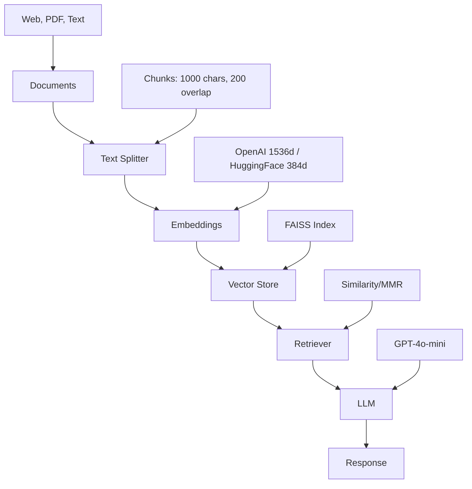

# LangChain RAG Tutorial


A practical tutorial for building a **Retrieval-Augmented Generation (RAG)** system using LangChain, with comprehensive comparisons of embeddings and retrieval strategies.

## Quick Start

```bash
# Clone and navigate to project
cd llm_rag

# Create virtual environment
python3 -m venv venv
source venv/bin/activate  # Windows: venv\Scripts\activate

# Install dependencies
pip install -r requirements.txt

# Configure API key
echo "OPENAI_API_KEY=sk-proj-..." > .env

# Launch notebook
jupyter notebook langchain_rag_tutorial.ipynb
```

## Architecture



## Features

- **Document Loading**: Web, PDF, and text sources with metadata
- **Text Splitting**: Configurable chunking strategies
- **Embedding Comparison**: OpenAI vs HuggingFace (local)
- **Retrieval Strategies**: Similarity Search vs MMR (Maximal Marginal Relevance)
- **Complete RAG Chains**: End-to-end implementation using LCEL
- **Metadata Filtering**: Advanced querying with source attribution
- **Best Practices**: Performance optimization and common pitfalls

## Technology Comparison

### Embeddings: OpenAI vs HuggingFace

| Feature        | OpenAI           | HuggingFace (all-MiniLM-L6-v2) |
| -------------- | ---------------- | ------------------------------ |
| **Quality**    | Excellent        | Very Good                      |
| **Dimensions** | 1536             | 384                            |
| **Speed**      | Fast (API ~0.2s) | Faster (local ~0.05s)          |
| **Cost**       | Pay-per-use      | Free                           |
| **Privacy**    | Cloud-based      | Local                          |
| **Setup**      | API key only     | Model download (~90MB)         |
| **Internet**   | Required         | Not required (after download)  |

**Recommendation**: OpenAI for production quality, HuggingFace for development/privacy/offline use.

### Retrieval: Similarity Search vs MMR

| Feature        | Similarity Search | MMR               |
| -------------- | ----------------- | ----------------- |
| **Relevance**  | Maximum           | High              |
| **Diversity**  | Low               | Maximum           |
| **Speed**      | Fast              | Slower            |
| **Redundancy** | Possible          | Minimized         |
| **Best For**   | Specific queries  | Topic exploration |

**Recommendation**: Similarity for precise queries, MMR for diverse perspectives.

**MMR Parameters Explained:**
```python
mmr_retriever = vectorstore.as_retriever(
    search_type="mmr",
    search_kwargs={
        "k": 4,              # Number of documents to return
        "fetch_k": 20,       # Documents to fetch before MMR filtering
        "lambda_mult": 0.5   # Balance: 1.0=relevance, 0.0=diversity
    }
)
```

### Text Splitting Strategies

The notebook compares two chunking approaches:

**Strategy A: Larger Chunks (Better for context)**
- `chunk_size=1000` characters
- `chunk_overlap=200` characters
- Result: ~120 chunks (fewer, longer pieces)
- Best for: Questions requiring broader context

**Strategy B: Smaller Chunks (Better for precision)**
- `chunk_size=500` characters
- `chunk_overlap=100` characters
- Result: ~256 chunks (more, shorter pieces)
- Best for: Specific information retrieval

**Why overlap matters:** Ensures context isn't lost at chunk boundaries, preserving sentence meaning across splits.

## Project Structure

```text
llm_rag/
├── langchain_rag_tutorial.ipynb  # Main tutorial notebook (10 sections)
├── requirements.txt              # Python dependencies
├── .env                          # API keys (create this)
├── .gitignore                   # Excludes secrets and models
└── README.md                    # This file
```

## Configuration

### Required: OpenAI API Key

1. Get your API key from [OpenAI Platform](https://platform.openai.com/api-keys)
1. Create `.env` file in project root:

```bash
OPENAI_API_KEY=sk-proj-your-key-here
```

### Optional: HuggingFace Embeddings

**Local embeddings** (no API key needed):

```python
from langchain_huggingface import HuggingFaceEmbeddings

hf_embeddings = HuggingFaceEmbeddings(
    model_name="sentence-transformers/all-MiniLM-L6-v2"
)
```

**Note**: Model downloads automatically on first run (~90MB). Set `TOKENIZERS_PARALLELISM=false` in `.env` to suppress warnings.

### API Key Validation

**⚠️ IMPORTANT SECURITY PRACTICE:**
- **Never hardcode API keys** in your notebooks or code
- Always use environment variables or `.env` files
- Never commit `.env` files to version control (already in `.gitignore`)

**Test your OpenAI API key immediately after setup:**

```python
from openai import OpenAI

# Test API key
client = OpenAI(api_key="your-key-from-env")
response = client.models.list()
print(f"✓ API key is VALID! {len(list(response.data))} models available")
```

**If validation fails:**
1. Verify your key at [OpenAI Platform](https://platform.openai.com/api-keys)
2. Check for extra spaces or newlines in `.env` file
3. Restart Jupyter kernel after updating `.env`
4. Ensure your OpenAI account has credits/billing set up

**Alternative for Google Colab:**
```python
from google.colab import userdata
OPENAI_API_KEY = userdata.get('OPENAI_API_KEY')
```

## Usage

### Run Complete Notebook

```bash
# Ensure virtual environment is active
source venv/bin/activate

# Start Jupyter
jupyter notebook

# Open langchain_rag_tutorial.ipynb
# Execute: Kernel → Restart & Run All
```

### Notebook Sections

1. **Setup & Installation** - Dependencies and API validation
1. **Document Loading** - WebBaseLoader with metadata
1. **Text Splitting** - RecursiveCharacterTextSplitter strategies
1. **Embeddings** - OpenAI vs HuggingFace comparison
1. **Vector Stores** - FAISS indexing and search
1. **Retrieval Strategies** - Similarity vs MMR testing
1. **RAG Chains** - Complete chain construction with LCEL
1. **Evaluation** - Multi-query testing and comparison
1. **Advanced Features** - Metadata filtering, custom retrievers
1. **Best Practices** - Pitfalls, optimization, security

### Quick Examples

**Example 1: Basic RAG Query**
```python
# Query the RAG system
query = "How to build a RAG agent with LangChain?"
response = retrieval_chain.invoke({"input": query})

print(response["answer"])
# Output: "To build a RAG agent with LangChain, you need to:
#  1. Load documents using document loaders
#  2. Split text into chunks
#  3. Create embeddings and vector store
#  4. Set up a retriever
#  5. Combine with an LLM using LCEL chains..."
```

**Example 2: Metadata Filtering**
```python
# Filter by custom metadata
filtered_retriever = vectorstore.as_retriever(
    search_kwargs={
        "k": 4,
        "filter": {"source_type": "web_documentation", "domain": "langchain"}
    }
)
results = filtered_retriever.get_relevant_documents("What is a retriever?")
```

**Example 3: Source Attribution**
```python
# Show which sources were used
response = retrieval_chain.invoke({"input": "Explain MMR retrieval"})

sources = set(doc.metadata['source'] for doc in response['context'])
print(f"Answer based on {len(sources)} sources:")
for source in sources:
    print(f"  - {source}")
```

## Requirements

- **Python**: 3.10-3.12 recommended
  - **Note**: Python 3.13+ may show Pydantic v1 compatibility warnings (non-breaking)
  - Tested successfully on 3.10, 3.11, 3.12, 3.14
- **RAM**: 4GB+ (for sentence-transformers models)
- **API**: OpenAI API key (required)

## Technologies

- **LangChain** (≥0.1.0) - Orchestration framework
- **OpenAI** - GPT-4o-mini LLM (temperature=0 for deterministic responses)
  - Embeddings: `text-embedding-3-small` (1536 dimensions)
- **FAISS** - Vector similarity search (Facebook AI)
- **Sentence Transformers** - Local embeddings
  - Model: `sentence-transformers/all-MiniLM-L6-v2` (384 dimensions)
- **BeautifulSoup4** - Web document parsing
- **Python-dotenv** - Environment configuration

## Performance Expectations

### Typical Execution Times

| Operation | OpenAI Embeddings | HuggingFace Embeddings |
|-----------|-------------------|------------------------|
| **Vector Store Creation** (120 docs) | ~1.0s | ~2.0s (first run) / ~0.5s (cached) |
| **Single Query Embedding** | ~0.2s | ~0.05s (after model cached) |
| **First Run** (with model download) | ~0.2s | ~2-3s (one-time) |
| **Retrieval (k=4)** | ~0.1s | ~0.1s |
| **Full RAG Query** (retrieval + LLM) | ~1-2s | ~1-2s |

**Note**: HuggingFace first run includes one-time model download (~90MB). Subsequent runs are 4-5x faster once model is cached locally at `~/.cache/huggingface/`.

### Resource Requirements

- **Initial Setup:**
  - HuggingFace model download: ~90MB (one-time, 1-2 minutes)
  - Model cached in `~/.cache/huggingface/`

- **Runtime Memory:**
  - Base notebook: ~500MB
  - With HuggingFace models loaded: ~2-3GB
  - Peak during vector store creation: ~3-4GB

- **Disk Space:**
  - Project files: <1MB
  - Virtual environment: ~500MB
  - HuggingFace models: ~90MB
  - Total: ~600MB

### First Run vs Subsequent Runs

**First run will be slower due to:**
1. HuggingFace model download (~90MB)
2. Package initialization and caching
3. FAISS index construction

**Subsequent runs are faster:**
- Models already cached locally
- No download required
- Typical notebook execution: 2-3 minutes

## Troubleshooting

### Invalid API Key

```bash
# Verify .env file
cat .env | grep OPENAI_API_KEY

# Restart Jupyter kernel after .env changes
```

### Module Not Found

```bash
pip install -r requirements.txt --upgrade
```

### FAISS Import Error (Mac Apple Silicon)

```bash
pip uninstall faiss-cpu
pip install faiss-cpu --no-cache-dir
```

### Memory Issues

**Symptoms:**
- Kernel crashes or restarts
- "MemoryError" or "Killed" messages
- System becomes unresponsive

**Solutions (in order of priority):**
1. **Reduce chunk count:**
   - Change `chunk_size=1000` to `chunk_size=500`
   - Fewer, larger chunks use less memory

2. **Reduce retrieval size:**
   - Change `k=4` to `k=2` or `k=3`
   - For MMR, reduce `fetch_k=20` to `fetch_k=10`

3. **Use fewer documents:**
   - Start with 1-2 URLs instead of 4
   - Test with smaller dataset first

4. **Close other applications:**
   - Free up system RAM before running
   - Restart Jupyter kernel: Kernel → Restart

### HuggingFace Warnings

**Tokenizers parallelism warning:**
```
huggingface/tokenizers: The current process just got forked, after parallelism has already been used...
```

**Two solutions (choose one):**

**Option 1: Set in code (recommended)**
```python
import os
os.environ["TOKENIZERS_PARALLELISM"] = "false"
```

**Option 2: Set in .env file**
```bash
TOKENIZERS_PARALLELISM=false
```

**Note:** Setting in code is preferred as it's applied immediately. If using `.env`, you must restart the Jupyter kernel.

### Kernel Restart Required

**Restart kernel after:**
- Installing new packages
- Updating `.env` file
- Changing environment variables
- Getting import errors

**How to restart:** Kernel → Restart & Clear Output

### Model Download Issues

**Slow or failed downloads:**

- First run downloads ~90MB from HuggingFace Hub
- Requires internet connection initially
- Models cached in `~/.cache/huggingface/`
- Download time: 1-2 minutes on typical connection

**If download fails:**
1. Check internet connectivity
2. Check disk space (need ~200MB free)
3. Try again - download may resume
4. Clear cache: `rm -rf ~/.cache/huggingface/` and retry

## Advanced Topics

### Prompt Template Used

The notebook uses this prompt structure for RAG:

```python
from langchain_core.prompts import ChatPromptTemplate

prompt = ChatPromptTemplate.from_messages([
    ("system", """You are a helpful AI assistant. Answer the user's question based on the context provided below.

If the context doesn't contain enough information to answer the question, say so clearly.
Always cite which parts of the context you used to formulate your answer.

Context:
{context}"""),
    ("user", "{input}"),
])
```

**Key elements:**
- System message instructs behavior
- Requires citing sources
- Admits when information is insufficient
- Context injected via `{context}` variable
- User query via `{input}` variable

### LCEL Patterns Used

The notebook uses **LangChain Expression Language (LCEL)** for composable chains:

```python
from langchain.chains.combine_documents import create_stuff_documents_chain
from langchain.chains import create_retrieval_chain

# Document processing chain
document_chain = create_stuff_documents_chain(llm, prompt)

# Complete RAG chain
retrieval_chain = create_retrieval_chain(retriever, document_chain)

# Invoke the chain
response = retrieval_chain.invoke({"input": "your question"})
```

**Benefits of LCEL:**
- Composable: Combine components easily
- Streaming support: Stream responses token-by-token
- Tracing: Debug with LangSmith
- Type-safe: Better IDE support

### Document Loading URLs

The notebook loads documentation from these LangChain URLs:

```python
urls = [
    "https://python.langchain.com/docs/use_cases/question_answering/",
    "https://python.langchain.com/docs/modules/data_connection/retrievers/",
    "https://python.langchain.com/docs/modules/model_io/llms/",
    "https://python.langchain.com/docs/use_cases/chatbots/"
]
```

**You can replace these with:**
- Your own documentation
- Company knowledge base
- Research papers (via ArXiv loader)
- Local PDF files (via PyPDFLoader)

### Custom Metadata Fields

The notebook adds these metadata fields to documents:

```python
import datetime

for doc in docs:
    doc.metadata['source_type'] = 'web_documentation'
    doc.metadata['process_date'] = datetime.date.today().isoformat()
    doc.metadata['domain'] = 'langchain'
```

**Use metadata for:**
- Filtering: Retrieve only specific document types
- Source attribution: Show where information came from
- Access control: Filter by user permissions
- Temporal filtering: Get only recent documents

### Production Considerations

**For production deployments, consider:**

1. **Model Selection:**
   - Use `gpt-4` instead of `gpt-4o-mini` for higher quality
   - Test with your specific domain/use case
   - Consider fine-tuned models

2. **Caching:**
   - Cache embeddings to avoid recomputing
   - Save/load FAISS indexes: `vectorstore.save_local()` / `FAISS.load_local()`
   - Cache LLM responses for common queries

3. **Monitoring:**
   - Track query latency and costs
   - Monitor retrieval quality
   - Use LangSmith for tracing and debugging
   - Log failed queries for improvement

4. **Security:**
   - Validate and sanitize user inputs
   - Implement rate limiting
   - Use API key rotation
   - Audit access logs

5. **Scalability:**
   - Use async operations for parallel requests
   - Consider vector DB instead of FAISS (Pinecone, Weaviate, Chroma)
   - Implement load balancing
   - Batch document processing

6. **Error Handling:**
   - Wrap model initialization in try-except blocks
   - Provide actionable troubleshooting messages
   - Example: HuggingFace embeddings initialization (see Cell 15 in notebook)
   - Gracefully handle API failures with retry logic
   - Log errors with context for debugging

## License

MIT License - Free for educational and commercial use

## Resources

- [LangChain Documentation](https://python.langchain.com/)
- [OpenAI API Reference](https://platform.openai.com/docs/api-reference)
- [HuggingFace Model Hub](https://huggingface.co/models)
- [Sentence Transformers](https://www.sbert.net/)
- [FAISS GitHub](https://github.com/facebookresearch/faiss)
- [RAG Paper (Lewis et al.)](https://arxiv.org/abs/2005.11401)
