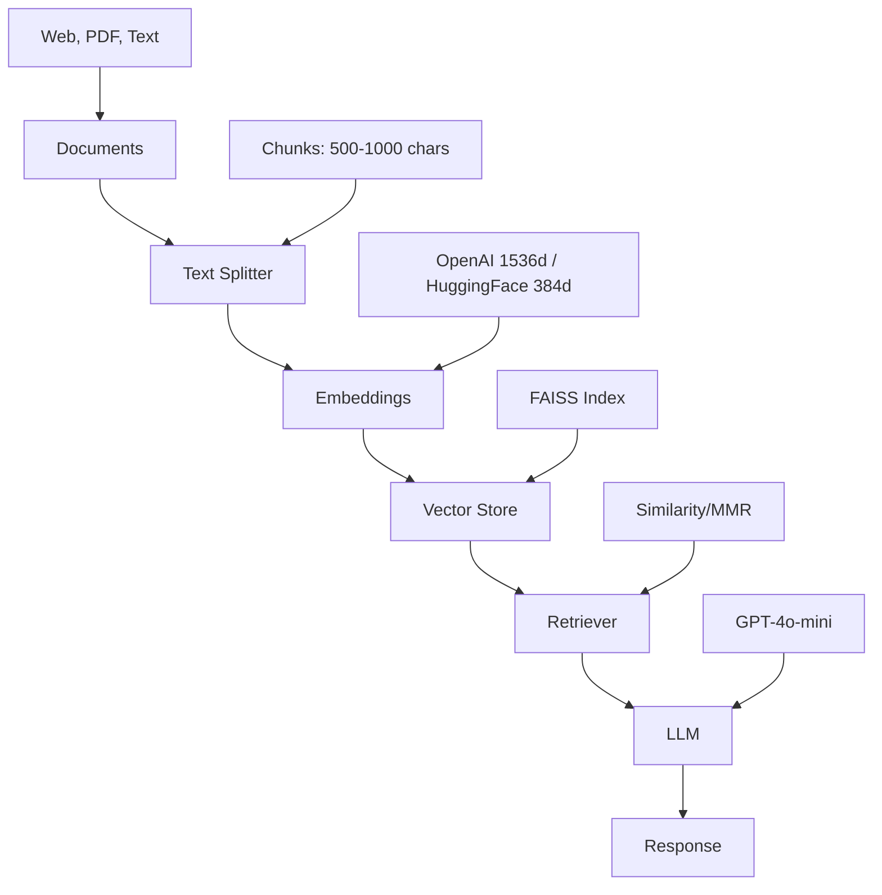

# LangChain RAG Tutorial


A practical tutorial for building a **Retrieval-Augmented Generation (RAG)** system using LangChain, with comprehensive comparisons of embeddings and retrieval strategies.

## Quick Start

```bash
# Clone and navigate to project
cd llm_rag

# Create virtual environment
python3 -m venv venv
source venv/bin/activate  # Windows: venv\Scripts\activate

# Install dependencies
pip install -r requirements.txt

# Configure API key
echo "OPENAI_API_KEY=sk-proj-..." > .env

# Launch notebook
jupyter notebook langchain_rag_tutorial.ipynb
```

## Architecture



## Features

- **Document Loading**: Web, PDF, and text sources with metadata
- **Text Splitting**: Configurable chunking strategies
- **Embedding Comparison**: OpenAI vs HuggingFace (local)
- **Retrieval Strategies**: Similarity Search vs MMR (Maximal Marginal Relevance)
- **Complete RAG Chains**: End-to-end implementation using LCEL
- **Metadata Filtering**: Advanced querying with source attribution
- **Best Practices**: Performance optimization and common pitfalls

## Technology Comparison

### Embeddings: OpenAI vs HuggingFace

| Feature        | OpenAI           | HuggingFace (all-MiniLM-L6-v2) |
| -------------- | ---------------- | ------------------------------ |
| **Quality**    | Excellent        | Very Good                      |
| **Dimensions** | 1536             | 384                            |
| **Speed**      | Fast (API ~0.2s) | Faster (local ~0.05s)          |
| **Cost**       | Pay-per-use      | Free                           |
| **Privacy**    | Cloud-based      | Local                          |
| **Setup**      | API key only     | Model download (~90MB)         |
| **Internet**   | Required         | Not required (after download)  |

**Recommendation**: OpenAI for production quality, HuggingFace for development/privacy/offline use.

### Retrieval: Similarity Search vs MMR

| Feature        | Similarity Search | MMR               |
| -------------- | ----------------- | ----------------- |
| **Relevance**  | Maximum           | High              |
| **Diversity**  | Low               | Maximum           |
| **Speed**      | Fast              | Slower            |
| **Redundancy** | Possible          | Minimized         |
| **Best For**   | Specific queries  | Topic exploration |

**Recommendation**: Similarity for precise queries, MMR for diverse perspectives.

## Project Structure

```text
llm_rag/
├── langchain_rag_tutorial.ipynb  # Main tutorial notebook (10 sections)
├── requirements.txt              # Python dependencies
├── .env                          # API keys (create this)
├── .gitignore                   # Excludes secrets and models
└── README.md                    # This file
```

## Configuration

### Required: OpenAI API Key

1. Get your API key from [OpenAI Platform](https://platform.openai.com/api-keys)
1. Create `.env` file in project root:

```bash
OPENAI_API_KEY=sk-proj-your-key-here
```

### Optional: HuggingFace Embeddings

**Local embeddings** (no API key needed):

```python
from langchain_huggingface import HuggingFaceEmbeddings

hf_embeddings = HuggingFaceEmbeddings(
    model_name="sentence-transformers/all-MiniLM-L6-v2"
)
```

**Note**: Model downloads automatically on first run (~90MB). Set `TOKENIZERS_PARALLELISM=false` in `.env` to suppress warnings.

## Usage

### Run Complete Notebook

```bash
# Ensure virtual environment is active
source venv/bin/activate

# Start Jupyter
jupyter notebook

# Open langchain_rag_tutorial.ipynb
# Execute: Kernel → Restart & Run All
```

### Notebook Sections

1. **Setup & Installation** - Dependencies and API validation
1. **Document Loading** - WebBaseLoader with metadata
1. **Text Splitting** - RecursiveCharacterTextSplitter strategies
1. **Embeddings** - OpenAI vs HuggingFace comparison
1. **Vector Stores** - FAISS indexing and search
1. **Retrieval Strategies** - Similarity vs MMR testing
1. **RAG Chains** - Complete chain construction with LCEL
1. **Evaluation** - Multi-query testing and comparison
1. **Advanced Features** - Metadata filtering, custom retrievers
1. **Best Practices** - Pitfalls, optimization, security

## Requirements

- **Python**: 3.8+ (tested on 3.14)
- **RAM**: 4GB+ (for sentence-transformers models)
- **API**: OpenAI API key (required)

## Technologies

- **LangChain** (≥0.1.0) - Orchestration framework
- **OpenAI** - GPT-4o-mini LLM and embeddings
- **FAISS** - Vector similarity search
- **Sentence Transformers** - Local embeddings
- **BeautifulSoup4** - Web document parsing
- **Python-dotenv** - Environment configuration

## Troubleshooting

### Invalid API Key

```bash
# Verify .env file
cat .env | grep OPENAI_API_KEY

# Restart Jupyter kernel after .env changes
```

### Module Not Found

```bash
pip install -r requirements.txt --upgrade
```

### FAISS Import Error (Mac Apple Silicon)

```bash
pip uninstall faiss-cpu
pip install faiss-cpu --no-cache-dir
```

### Memory Issues

- Reduce `chunk_size` to 500
- Decrease `k` parameter in retrievers to 2-3
- Use fewer source documents

### HuggingFace Warnings

**Tokenizers parallelism warning:**

```bash
# Add to .env file
TOKENIZERS_PARALLELISM=false
```

**Model download slow/fails:**

- First run downloads ~90MB from HuggingFace Hub
- Requires internet connection initially
- Models cached in `~/.cache/huggingface/`
- Check disk space and network connectivity

## License

MIT License - Free for educational and commercial use

## Resources

- [LangChain Documentation](https://python.langchain.com/)
- [OpenAI API Reference](https://platform.openai.com/docs/api-reference)
- [HuggingFace Model Hub](https://huggingface.co/models)
- [Sentence Transformers](https://www.sbert.net/)
- [FAISS GitHub](https://github.com/facebookresearch/faiss)
- [RAG Paper (Lewis et al.)](https://arxiv.org/abs/2005.11401)
