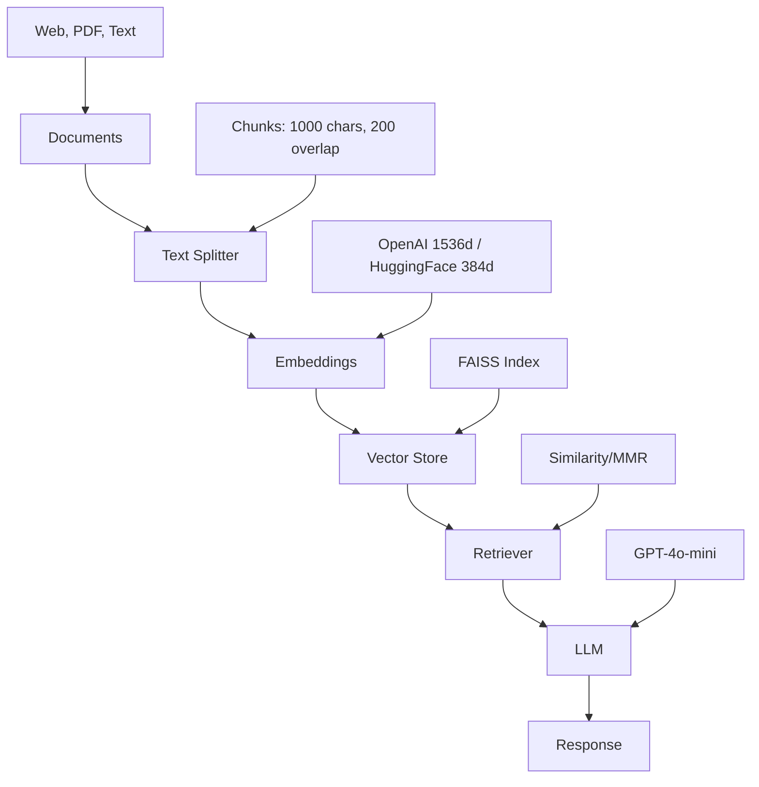

# Architecture

Design decisions and technical architecture of LangChain RAG Tutorial.

## System Overview



## Project Structure

### Modular Design

```
llm_rag/
├── shared/                    # Reusable utilities (DRY principle)
├── notebooks/
│   ├── fundamentals/         # Core concepts (01-03)
│   └── advanced_architectures/ # Advanced patterns (04-16)
├── data/                     # Generated artifacts, Chinook DB (gitignored)
└── docs/                     # Modular documentation
```

**Design Rationale:**

- **Modularity**: Each architecture in separate notebook
- **Reusability**: Shared module eliminates code duplication (1500+ lines shared, 30+ prompts)
- **Persistence**: Vector stores saved to avoid re-embedding
- **Progressive Learning**: Simple → Advanced complexity gradient

## Architecture Patterns

### 1. Simple RAG (⭐)

**Pattern**: Query → Retrieve → Generate  
**Use Case**: General Q&A, fast responses  
**Complexity**: Minimal

### 2. Memory RAG (⭐⭐)

**Pattern**: Query + History → Retrieve → Generate  
**Use Case**: Chatbots, conversational AI  
**Key Component**: `RunnableWithMessageHistory`

### 3. Branched RAG (⭐⭐⭐)

**Pattern**: Query → Generate Sub-queries → Parallel Retrieve → Merge → Generate  
**Use Case**: Research, comprehensive coverage  
**Key Component**: `MultiQueryRetriever`

### 4. HyDe (⭐⭐⭐)

**Pattern**: Query → Generate Hypothetical Answer → Embed → Retrieve → Generate  
**Use Case**: Ambiguous queries, technical jargon  
**Innovation**: Semantic matching via hypothetical documents

### 5. Adaptive RAG (⭐⭐⭐⭐)

**Pattern**: Query → Classify Complexity → Route to Strategy → Retrieve → Generate  
**Use Case**: Mixed workloads, cost optimization  
**Routes**: SIMPLE→Similarity, MEDIUM→MMR, COMPLEX→HyDe

### 6. Corrective RAG (⭐⭐⭐⭐)

**Pattern**: Query → Retrieve → Grade Relevance → [Poor: Web Search] → Generate  
**Use Case**: High-accuracy domains (legal, medical)  
**Key Component**: Relevance grader + DuckDuckGo fallback

### 7. Self-RAG (⭐⭐⭐⭐⭐)

**Pattern**: Query → Decide Retrieval → Retrieve → Generate → Self-Critique → [Retry if poor]  
**Use Case**: Quality-critical, exploratory research  
**Innovation**: Autonomous retrieval decision + iterative refinement

### 8. Agentic RAG (⭐⭐⭐⭐⭐)

**Pattern**: Query → Agent Loop (Think → Select Tool → Execute → Observe) → Final Answer
**Use Case**: Complex multi-step reasoning, BI dashboards
**Tools**: Retriever, Calculator, Web Search
**Key Component**: ReAct agent pattern

### 9. Contextual RAG ✨ (⭐⭐⭐)

**Pattern**: Documents → Summarize → Context-Augment Chunks → Embed → Query → Retrieve → Generate
**Use Case**: Technical docs, code documentation
**Innovation**: Anthropic's technique - prepend document context to each chunk
**Benefits**: 15-30% better retrieval quality with minimal overhead

### 10. Fusion RAG ✨ (⭐⭐⭐)

**Pattern**: Query → Generate Multi-Perspectives → Parallel Retrieve → RRF Ranking → Generate
**Use Case**: Research, best ranking quality
**Key Component**: Reciprocal Rank Fusion (RRF) algorithm
**Innovation**: Documents appearing in multiple result sets rank higher

### 11. SQL RAG ✨ (⭐⭐⭐⭐)

**Pattern**: Query → Retrieve Schema → Generate SQL → Validate → Execute → Interpret Results
**Use Case**: Analytics, BI, structured data queries
**Key Components**: Schema retrieval, safe SQL execution (read-only, SELECT only)
**Database**: Chinook sample database (music store)

### 12. GraphRAG ✨ (⭐⭐⭐⭐⭐)

**Pattern**: Documents → Extract Entities → Extract Relationships → Build Graph → Query → Traverse → Generate
**Use Case**: Knowledge graphs, relationship queries, multi-hop reasoning
**Key Components**: Entity extraction, NetworkX graph, community detection (Louvain)
**Innovation**: Microsoft Research's approach to graph-based knowledge retrieval

## Technology Stack

### Core Dependencies

- **LangChain**: v0.1.0+ (framework, LCEL)
- **OpenAI SDK**: v1.12.0+ (GPT-4o-mini, embeddings)
- **FAISS**: v1.7.4+ (vector similarity search)
- **HuggingFace Transformers**: Local embeddings
- **Python**: 3.9+ (type hints, pathlib)

### New Dependencies ✨

- **NetworkX**: v3.2+ (graph algorithms, GraphRAG)
- **SQLAlchemy**: v2.0.25+ (database abstraction, SQL RAG)
- **Pandas**: v2.2.0+ (data manipulation, SQL results)
- **RAGAS**: v0.1.7+ (RAG evaluation framework)
- **Spacy**: v3.7.0+ (NLP, entity extraction)
- **Matplotlib**: v3.8.0+ (graph visualization)

### Architecture Decisions

#### Why LangChain?

- **LCEL**: Composable chains with `|` operator
- **Extensive integrations**: 700+ integrations
- **Active community**: Rapid updates, good docs

#### Why FAISS?

- **Performance**: Facebook AI optimized
- **Local-first**: No external dependencies
- **Persistence**: Save/load vector stores

#### Why GPT-4o-mini?

- **Cost-effective**: $0.15/1M input tokens
- **Fast**: ~1-2s response time
- **Quality**: Good enough for tutorials

#### Why HuggingFace Embeddings?

- **Free**: No API costs
- **Local**: Runs offline after download
- **Decent quality**: 384d embeddings, good for demos

## Design Patterns

### 1. Shared Module Pattern

```python
# Instead of copy-paste in each notebook
from shared import format_docs, load_vector_store, RAG_PROMPT_TEMPLATE
```

**Benefits:**

- DRY principle (Don't Repeat Yourself)
- Single source of truth
- Easy updates (change once, affect all)

### 2. Vector Store Persistence Pattern

```python
# Notebook 02: Create and save
vectorstore = FAISS.from_documents(chunks, embeddings)
save_vector_store(vectorstore, "data/vector_stores/openai")

# Notebooks 03-16: Load existing
vectorstore = load_vector_store("data/vector_stores/openai", embeddings)
```

**Benefits:**

- Avoid re-embedding (saves time + API costs)
- Consistent data across notebooks
- Faster iteration

### 3. Progressive Disclosure Pattern

```
00_index.ipynb → Overview + Navigation
01-03 → Fundamentals (required)
04-16 → Advanced (12 architectures + evaluation, pick based on use case)
```

**Benefits:**

- Learners not overwhelmed
- Clear prerequisites
- Flexible learning path

## Performance Considerations

### Latency Profile

| Architecture | Latency | API Calls | Cost |
|---|---|---|---|
| Simple RAG | ~2s | 1 LLM | Low |
| Memory RAG | ~2-3s | 1 LLM | Low-Med |
| Branched RAG | ~5-8s | 4 LLM (3 sub-queries + 1 gen) | Medium |
| HyDe | ~4-6s | 2 LLM (hypo + gen) | Medium |
| Contextual RAG ✨ | ~2-3s | 1 LLM + upfront context generation | Low |
| Fusion RAG ✨ | ~5-8s | 5-6 LLM (4-5 queries + gen) | Medium |
| Adaptive RAG | Variable | 2-3 LLM (classify + gen) | Optimized |
| SQL RAG ✨ | ~2-5s | 2-3 LLM (schema + SQL + interpret) | Low-Med |
| CRAG | ~10-15s | 5-6 LLM (grade x4 + gen + optional web) | High |
| Self-RAG | ~10-20s | 4-6 LLM (2-3 iterations) | High |
| GraphRAG ✨ | ~3-8s | 3-4 LLM + graph traversal | Medium-High |
| Agentic RAG | ~20-40s | 5-10 LLM (agent loop) | Very High |

### Optimization Strategies

1. **Caching**: Vector stores, embeddings
2. **Lazy Loading**: Load embeddings only when needed
3. **Batch Processing**: Process multiple queries together
4. **Async**: Use `ainvoke` for parallel calls

## Security Architecture

### API Key Management

```python
# ✅ Correct: Environment variables
from dotenv import load_dotenv
import os
load_dotenv()
api_key = os.getenv('OPENAI_API_KEY')

# ❌ Wrong: Hardcoded
api_key = "sk-proj-..."  # NEVER DO THIS
```

### Gitignore Strategy

```bash
# .gitignore
.env                    # Secrets
vector_stores/          # Generated data
__pycache__/            # Python cache
```

## Extensibility

### Adding New Architecture

1. Create notebook: `notebooks/advanced_architectures/17_new_pattern.ipynb`
2. Add prompts to `shared/prompts.py`
3. Update `11_comparison.ipynb` with new benchmark
4. Document in `notebooks/advanced_architectures/README.md`
5. Update CHANGELOG.md with the addition

### Adding New Utility

1. Add function to `shared/utils.py`
2. Export in `shared/__init__.py`
3. Document in `docs/API_REFERENCE.md`
4. Test in notebooks

## Future Enhancements

### Completed in v1.1.0 ✨

- [x] Graph RAG integration (notebook 15)
- [x] Advanced evaluation metrics (RAGAS framework, notebook 16)
- [x] SQL RAG for structured data (notebook 14)
- [x] Context-augmented retrieval (notebook 12)
- [x] Reciprocal Rank Fusion (notebook 13)

### Planned for v1.2.0+

- [ ] Multimodal RAG (images, audio, video)
- [ ] Fine-tuning embeddings guide
- [ ] Production deployment templates (FastAPI, Streamlit)
- [ ] Docker containerization
- [ ] CI/CD pipeline for notebook testing
- [ ] Monitoring and observability (LangSmith integration)
- [ ] Cost optimization strategies
- [ ] Batch processing patterns

## References

**Core RAG:**
- [LangChain Docs](https://python.langchain.com/)
- [FAISS Documentation](https://faiss.ai/)
- [RAG Paper (Lewis et al.)](https://arxiv.org/abs/2005.11401)

**Advanced Architectures:**
- [Self-RAG Paper](https://arxiv.org/abs/2310.11511)
- [CRAG Paper](https://arxiv.org/abs/2401.15884)
- [LangGraph Documentation](https://langchain-ai.github.io/langgraph/)

**New Architectures ✨:**
- [Contextual Retrieval (Anthropic)](https://www.anthropic.com/news/contextual-retrieval) - Context-augmented chunking
- [RAG-Fusion Paper](https://arxiv.org/abs/2402.03367) - Reciprocal Rank Fusion
- [GraphRAG (Microsoft Research)](https://www.microsoft.com/en-us/research/blog/graphrag-unlocking-llm-discovery-on-narrative-private-data/)
- [RAGAS Framework](https://docs.ragas.io/) - RAG evaluation metrics
- [Text-to-SQL Survey](https://arxiv.org/abs/2208.13629) - Natural language to SQL
- [NetworkX Documentation](https://networkx.org/) - Graph algorithms

## See Also

- [API_REFERENCE.md](API_REFERENCE.md) - Shared module API
- [PERFORMANCE.md](PERFORMANCE.md) - Benchmarks
- [DEPLOYMENT.md](DEPLOYMENT.md) - Production setup
